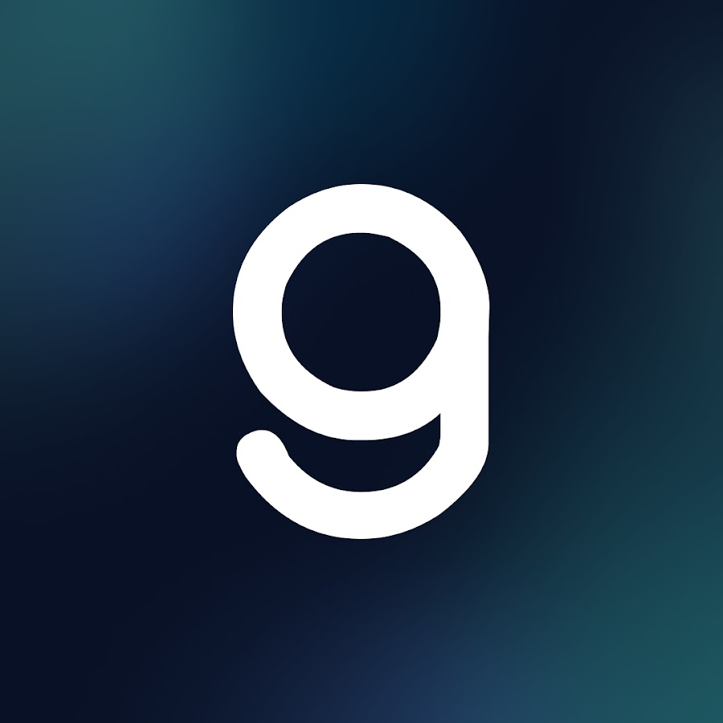
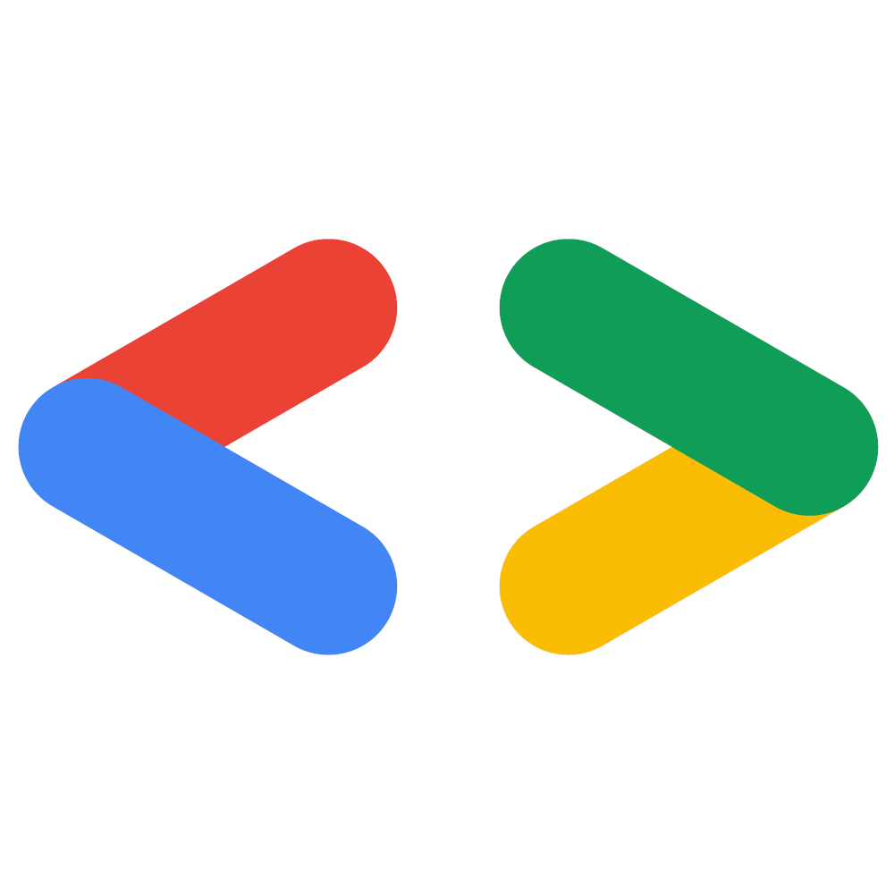
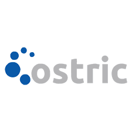

## PT Edukasi Rekanan Anda
- *Android Developer Intern* | Aug'23 - Dec'23
- 
- Tags: Work
- Badges:
  - Android [green]
  - Kotlin [purple]
  - Firebase [orange]
- List Items:
  - Collaborated with back-end, UI/UX, and QA teams to deliver user-friendly, reliable applications.
  - Practiced writing clean, readable code by following company coding standards and maintaining thorough documentation.
  - Contributed to refactoring the company application, improving its readability, maintainability, and scalability.

## Dicoding Indonesia
- *Kampus Merdeka Studi Independen Bersertifikat Program* | Aug'22 - Dec'22
- 
- Tags: Bootcamp
- Badges:
  - Android [green]
  - Kotlin [purple]
  - Firebase [orange]
  - UI/UX [cyan]
- List Items:
  - Gained comprehensive training in Android development, covering the fundamentals of Kotlin programming, software architecture, and common design patterns in Android applications.
  - Successfully completed 8 structured courses covering software development fundamentals, programming logic, version control with Git and GitHub, Kotlin programming, Android development (fundamental and intermediate levels), SOLID programming principles, and UX design basics.
  - Completed multiple project-based assignments, culminating in a capstone project: a fully functional crowdfunding Android application demonstrating the application of acquired skills in real-world scenarios.
  - Graduated as one of the top-performing participants, recognized for outstanding performance and consistency throughout the program.

## Universitas Pendidikan Indonesia
- *Bachelor of Computer Science* | 20 - 24
- 
- Tags: Education
- Badges:
  - Formal Education [blue]
- List Items:
  - GPA: 3.93/4.00
  - Activities: Google Developer Student Clubs UPI, Open-Source Research Society Kemakom UPI

## Google Developer Group Bandung
- *Volunteer* | 23 - 24
- 
- Tags: Organization
- Badges:
  - Graphic Design [blue]
  - Event [teal]
- List Items:
  - Designed promotional posters for social media, merchandise, and event properties, contributing to consistent and engaging visual branding.
  - Joined the documentation team for DevFest Bandung 2023 and Build With AI 2024, responsible for capturing and organizing event highlights and visual content.

## Google Developer Student Club UPI
- *Core Team* | Oct'22 - Jul'23
- 
- Tags: Organization
- Badges:
  - Graphic Design [blue]
  - Event [teal]
  - Android [green]
  - Kotlin [purple]
- List Items:
  - Contributed as a creative designer, producing merchandise and promotional posters for social media campaigns and organizational events.
  - Served as a mentor in the Android Development division, providing guidance and support to members.
  - Created structured learning materials for Android Development study jams to enhance peer learning.
  - Acted as a speaker in an Android Development study jam, sharing technical knowledge and best practices with fellow members.

## Open-Source Research Society Kemakom UPI
- *Member* | 21 - 22
- 
- Tags: Organization
- Badges:
  - Graphic Design [blue]
- List Items:
  - Designed educational Instagram content focused on programming topics, aimed at increasing engagement and promoting tech literacy through visually appealing and informative posts.