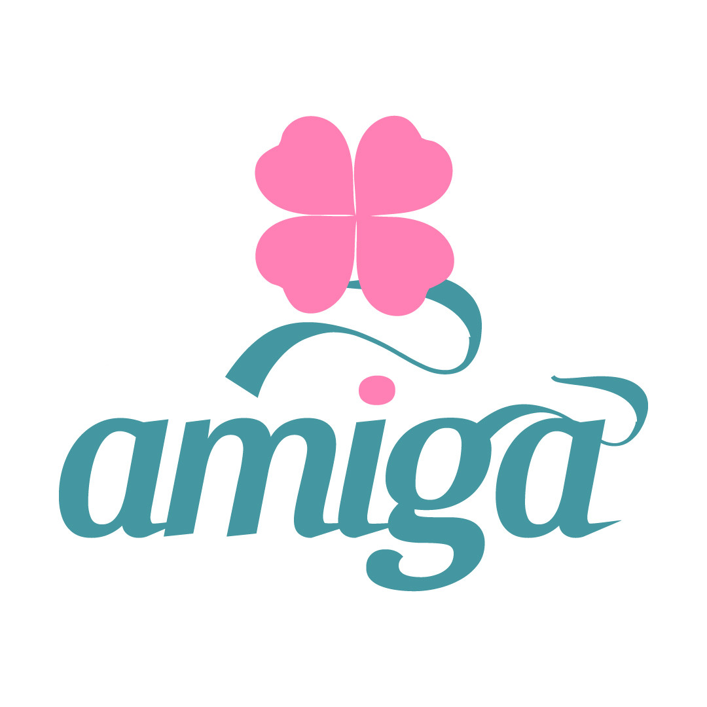
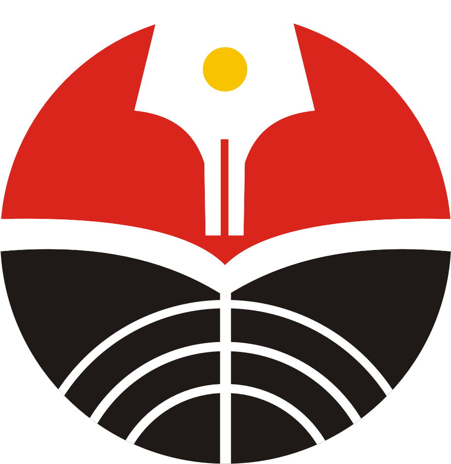
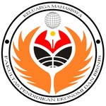
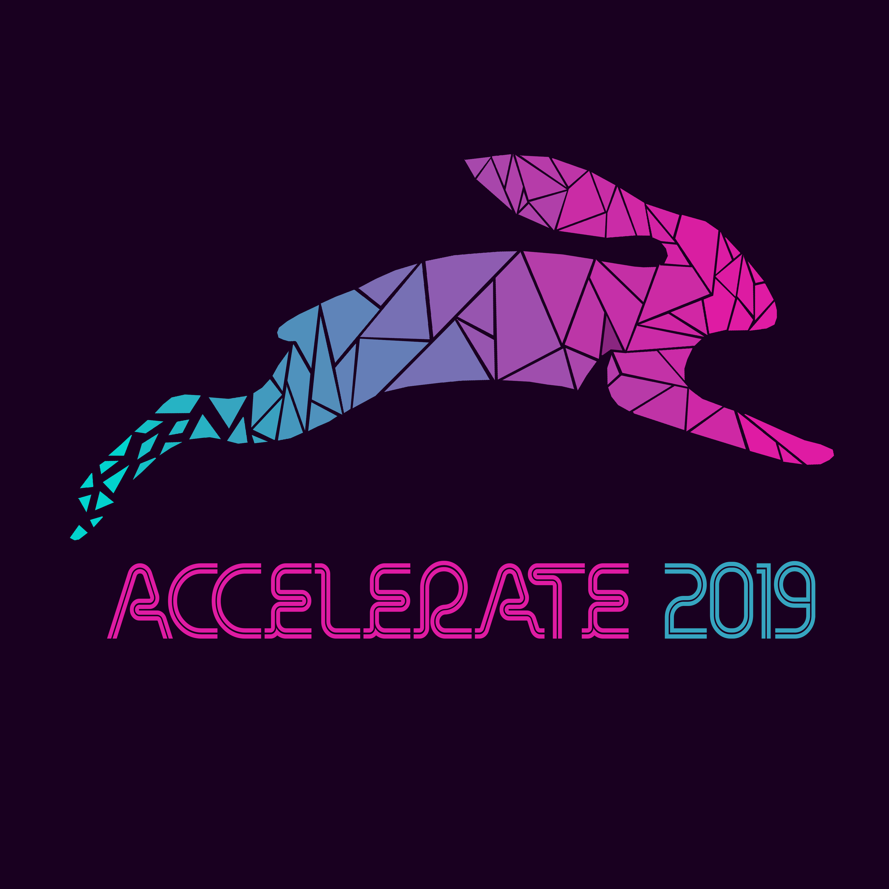

## PT Amiga
- *Graphic Designer* | Sep'21 - Sep'22
- 
- Tags: Work
- Badges:
  - Photoshop [green]
  - Illustrator [purple]
- List Items:
  - Responsible for creating social media, advertising, and print.
  - Creating and developing visual and brand identity.
  - Producing assets and illustrations for social media and websites.

## PT Amiga
- *Graphic Designer Intern* | Jan'21 - Apr'21
- 
- Tags: Work
- Badges:
  - Photoshop [green]
  - Illustrator [purple]
- List Items:
  - Responsible for creating social media, advertising, and print.
  - Creating and developing visual and brand identity.
  - Producing assets and illustrations for social media and websites.

## harisenin.com
- *UI/UX & Product Management* | Nov'25 - May'26
- 
- Tags: Bootcamp
- Badges:
  - Figma [pink]
  - UI/UX [red]
- List Items:
  - Gained comprehensive training in UI/UX Design and Product Management, covering the fundamentals of UI Design, UX Design, and common Product management.
  - Successfully completed 22 learning modules, including Basic of Product Management, UI/UX Overview, UX Writing, UX Research, User Persona, Design Principles and Fundamentals, Wireframing, Design Systems, and Prototyping.
  - Completed multiple project-based assignments, culminating in a capstone project: a fully functional educational Android application demonstrating the application of acquired skills in real-world scenarios.
  - Graduated as one of the top-performing participants, recognized for outstanding performance and consistency throughout the program.

## Universitas Pendidikan Indonesia
- *Bachelor of Accounting* | 17 - 24
- 
- Tags: Education
- Badges:
  - Formal Education [blue]
- List Items:
  - GPA: 3.20/4.00
  - Activities: IMAKSI UPI, KEMA FPEB UPI, Accelerate

## KEMA FPEB UPI
- *KOMINFO Department* | 20 - 21
- 
- Tags: Organization
- Badges:
  - Graphic Design [blue]
  - Event [teal]
- List Items:
  - Created informational media for both internal and external campus communications
  - Designed all social media content and visuals
  - Served as a liaison between campus departments for collaborative partnerships

## Accelerate
- *Creative Department* | Apr'19 - Dec'19
- 
- Tags: Organization
- Badges:
  - Graphic Design [blue]
  - Event [teal]
- List Items:
  - Contributed as a creative designer, producing merchandise and promotional posters for social media campaigns and organizational events.
  - Created stage layouts and decorations.
  - Worked as a stage photographer and videographer

## IMAKSI UPI
- *Head of KOMINFO Department* | Jan'19 - Jan'20
- 
- Tags: Organization
- Badges:
  - Graphic Design [blue]
  - Event [teal]
- List Items:
  - Created informational media for both internal and external campus communications
  - Designed all social media content and visuals
  - Served as a liaison between campus departments for collaborative partnerships
