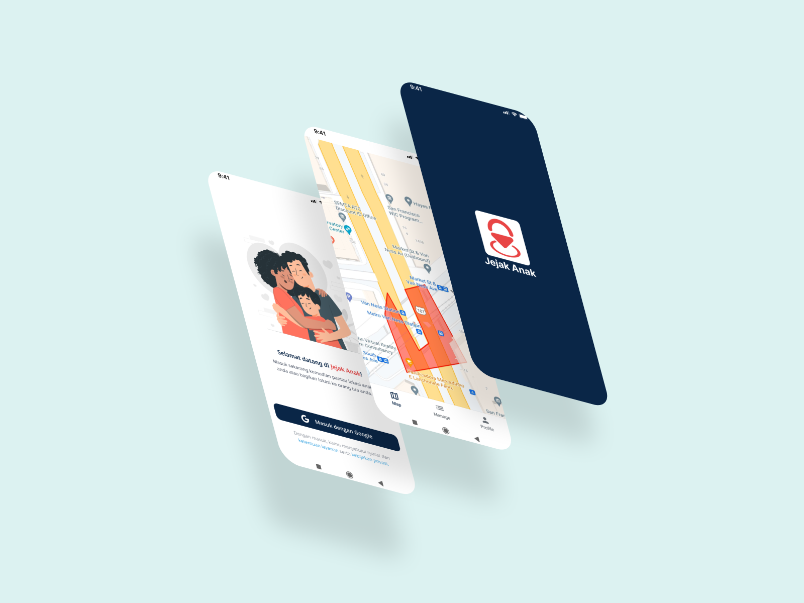
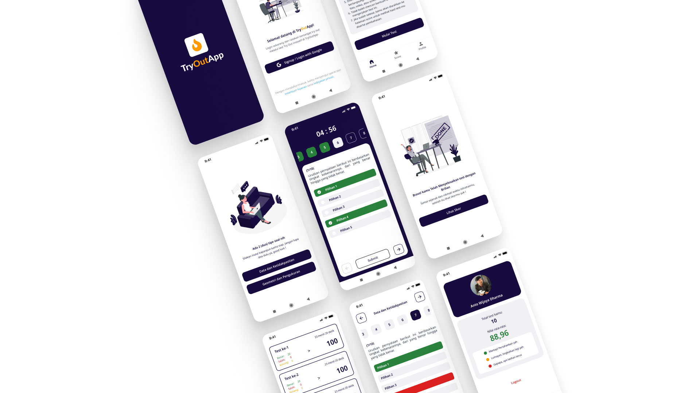
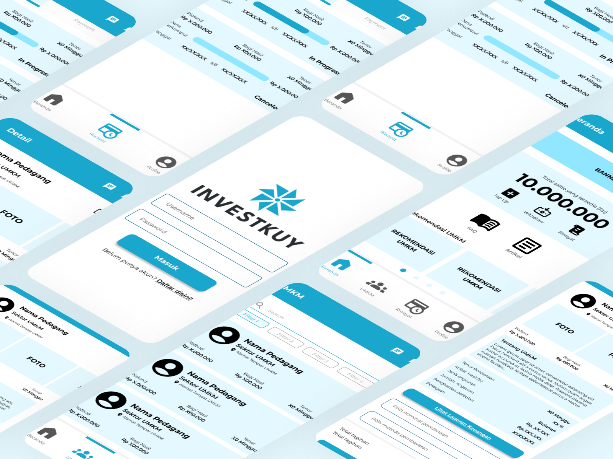

## Jejak Anak
An Android application designed to assist parents in monitoring their children's location using geofencing, implemented with the Winding Number algorithm for accurate zone detection.
- 
- Tags: Category 1
- Badges:
  - Android [green]
  - Kotlin [purple]
  - Firebase [orange]
  - Google Maps API [teal]
  - Geofencing [cyan]
- Buttons:
  - Github [https://github.com/ghifari21/Jejak-Anak-Android]

## Eureka Edutech
Eureka Edutech builds a learning application that can help students study and simulate real-time national assessments with a question bank that has been formulated in such a way.
- 
- Tags: Category 2
- Badges:
  - Android [green]
  - Kotlin [purple]
  - Firebase [orange]
  - Refactoring [pink]
- Buttons:
  - Link [https://www.eurekaedutech.com/]

## TryOut App
TryOut App is an educational application designed to support students in preparing for national assessments by providing a structured question bank and real-time exam simulations.
- 
- Tags: Category 3
- Badges:
  - Android [green]
  - Kotlin [purple]
  - Firebase [orange]
- Buttons:
  - Github [https://github.com/ghifari21/Eureka-TryoutApp]

## InvestKuy
A peer-to-peer lending application developed as a final project for the Visual Programming course, enabling users to provide funding support to Micro, Small, and Medium Enterprises (MSMEs).
- 
- Tags: Category 3
- Badges:
  - Flutter [blue]
  - Cubit [cyan]
  - Dart [teal]
- Buttons:
  - Github [https://github.com/ghifari21/investkuy]